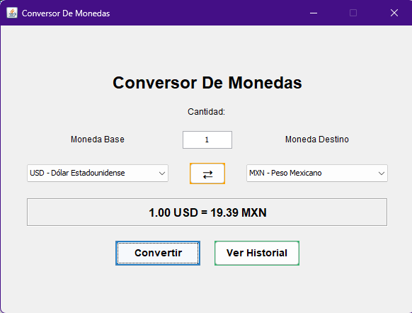
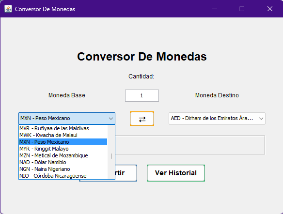
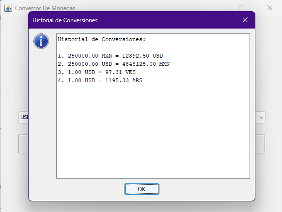
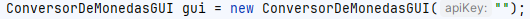

# Conversor de Monedas

---

## Descripción

El siguiente programa de **Java** permite al usuario realizar conversiones
de tipo de cambio entre monedas de todo el mundo mediante una interfaz 
gráfica fácil de usar, misma que fue realizada implementando la biblioteca
**Swing**, siendo la consulta de cambio de monedas posible gracias al uso de
la **API** de **ExchangeRate-API**

---

## Características de uso

- **¡Puedes realizar conversiones de dinero entre 161 monedas de todo el mundo!**

- **Puedes consultar con *Ver Historial* todas las conversiones que hayas hecho durante tu sesión de uso de esta aplicación**

- **Con el botón de en medio *⇄* puedes intercambiar entre las monedas para hacer las conversiones inversas**

- **Al seleccionar cada una de las cintas de opciones de elección de monedas puedes teclear en el teclado el código para elegir más rápidamente las monedas a obtener su conversión de tipo de cambio**

- **Las cantidades, *la ingresada para conocer su tipo de cambio y la de resultado*, se redondean a dos decimales para una visualización más limpía de las conversiones de cambio**

---

## Consideraciones de uso

- **Para utilizar el programa es necesario que como parametro de creación del objeto *gui* ingreses tu *APIKey* de *ExchangeRate-API***

- **Es importante instalar el plugin de Swing en IntelliJ IDEA**
- **El IDE recomendado de uso para este programa es IntelliJ IDEA**

---

## Licencia / License

Este proyecto está bajo la licencia Creative Commons Attribution-NonCommercial-ShareAlike 4.0 International (CC BY-NC-SA 4.0).

Esta licencia permite:
- Compartir: copiar y redistribuir el material en cualquier medio o formato
- Adaptar: remezclar, transformar y construir a partir del material

Bajo los siguientes términos:
- Atribución: Debes dar crédito adecuado, proporcionar un enlace a la licencia e indicar si se han realizado cambios.
- NoComercial: No puedes utilizar el material con fines comerciales.
- CompartirIgual: Si remezclas, transformas o creas a partir del material, debes distribuir tus contribuciones bajo la misma licencia que el original.

Consulta el archivo [LICENSE](LICENSE.md) para más detalles.